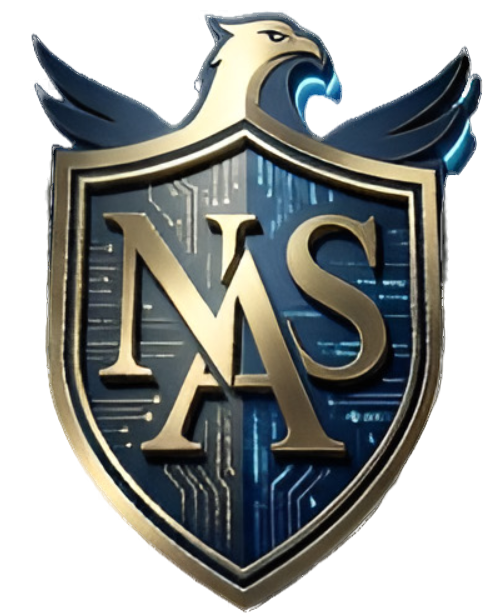

  

<h1 align="center">Hi, I'm Nabil Al Saidali</h1>

<b>AI/ML Engineer · Backend & Full-Stack Developer</b>

I build scalable AI systems and production-ready full-stack applications with clean backend architecture,
applied machine learning, and modern development workflows.

  
  

---

## Tech Stack

### AI / Machine Learning

### Backend Engineering

### Full-Stack Development

### Databases

### DevOps & Tools

### Systems / Graphics / Hardware

---

## Current Focus
- Applied AI engineering and ML pipelines
- Clean backend architecture and scalable APIs
- Production-ready systems integrating Laravel + Python
- Strengthening DevOps fundamentals
